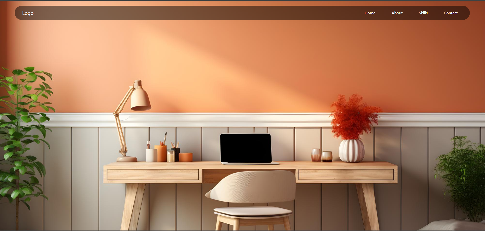

# Navbar-Template
This repository contains a simple navigation bar template built using HTML, CSS, and Bootstrap. It provides a responsive navbar layout that can be easily customized for various web projects.
--
🚀 Welcome to Navbar Template! 🚀

This repository contains a simple and customizable navigation bar template built using HTML, CSS, and Bootstrap. Use this template to quickly set up a responsive navbar for your web projects.

## Preview


🔗 [Live Preview](https://nehamaurya2311.github.io/Navbar-Template/)

## 🎨 Features

- Responsive design for various screen sizes.
- Easy to customize with CSS and Bootstrap.
- Simple structure for quick integration into your projects.
- Hover effects and animations for a dynamic user experience.

## Usage

1. Clone this repository to your local machine:

```bash
git clone https://github.com/NehaMaurya2311/navbar-template.git

```

2. Navigate to the project directory:

```bash
cd navbar-template
```

3. Open the `index.html` file in your preferred code editor.

4. Customize the navbar links, logo, and styling according to your project requirements.

5. Preview the changes in your browser and integrate the navbar template into your web project.

## Folder Structure

- `index.html`: Main HTML file containing the navbar structure.
- `css/`: Directory containing the custom CSS styles.
- `images/`: Directory for storing images used in the template.
- `README.md`: Documentation file providing instructions and information about the template.

## Contribution

Contributions are welcome! If you have any suggestions, feature requests, or bug fixes, feel free to open an issue or create a pull request.

## License

This project is licensed under the MIT License - see the [LICENSE](LICENSE) file for details.
--
